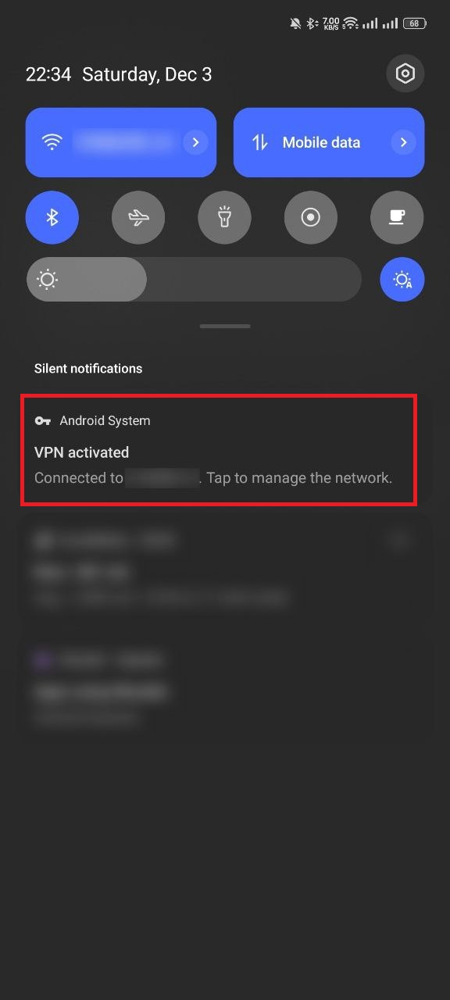
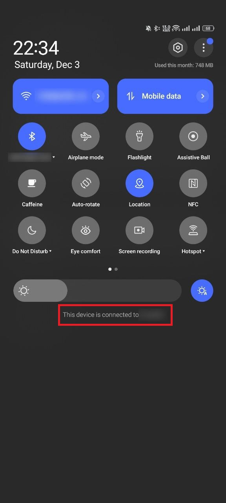

# OplusNoVpnNotification

Remove the annoy "VPN activated" notification for oplus systems.

## What it does?

This is a Xposed module for OxygenOS and ColorOS, which removes the "VPN activated" notification. By default, we are not able to disable it in settings.

## Optionally feature

It can also remove the VPN footer from the QS panel. Select SystemUI (com.android.systemui) scope in LSPosed manager if you would like to have it.

## Compatibility

It is only tested on OxygenOS 13. Try it out yourself.

## LICENSE

- [MIT](LICENSE)
